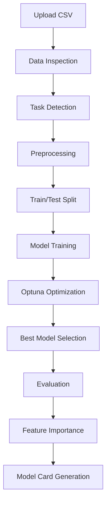

# 🚀 AutoML Benchmarking Bot

### *From Raw CSV → Optimized Model → Auto-Generated Insights in Minutes*

---

## 📌 Project Overview

The **AutoML Benchmarking Bot** is a fully automated machine learning pipeline built in Python and designed to run in Google Colab.

It transforms raw CSV datasets into optimized, production-ready models while automatically handling preprocessing, model selection, hyperparameter tuning, and reporting.

👉 **Colab Notebook:**
[https://colab.research.google.com/drive/1NbTqpY_7UrasrFZdttIXCiD8aSHYbnJG](https://colab.research.google.com/drive/1NbTqpY_7UrasrFZdttIXCiD8aSHYbnJG)

---

## 🎯 Objective

Build a **self-adaptive ML system** that:

* Accepts raw CSV data
* Detects problem type (Classification / Regression)
* Automates preprocessing
* Optimizes models using Bayesian tuning
* Generates a clean, ready-to-use report

---

# 🧠 System Architecture

### 🔄 Pipeline Flow

---

## ⚙️ Core Components

### 1️⃣ Smart Data Ingestion

* Upload datasets using `google.colab.files`
* Automatically inspects dataset structure
* Detects target variable type:

  * **Categorical / Low cardinality (<20 unique values)** → Classification
  * **Continuous numeric values** → Regression

---

### 2️⃣ Automated Preprocessing

Handles all essential preprocessing steps:

* **Missing Values:**

  * Numerical → Median imputation (robust to outliers)

* **Categorical Features:**

  * One-hot encoding using `pd.get_dummies`

* **Data Splitting:**

  * 80/20 Train-Test split

---

### 3️⃣ Optimization Engine

Powered by Optuna:

* Uses **Bayesian Optimization (TPE Sampler)**
* Avoids inefficient grid search
* Automatically prunes poor-performing trials

#### 🔍 Tuned Models

| Model         | Parameters                                   |
| ------------- | -------------------------------------------- |
| Random Forest | `n_estimators`, `max_depth`                  |
| XGBoost       | `learning_rate`, `max_depth`, `n_estimators` |

* Uses **3-Fold Cross Validation** for reliable evaluation

---

### 4️⃣ Model Benchmarking

Compares:

* **Baseline Models:** Linear / Logistic Regression
* **Advanced Models:** Random Forest, XGBoost

👉 Helps determine if complex models actually add value

---

### 5️⃣ Automated Model Documentation

Generates a complete **Model Card** including:

* Performance metrics (Accuracy, RMSE, etc.)
* Feature importance rankings
* Clean markdown report using `IPython.display.Markdown`

---

## ⚡ Performance Advantage

| Traditional Workflow | AutoML Bot            |
| -------------------- | --------------------- |
| Manual preprocessing | Automated             |
| Grid search tuning   | Bayesian optimization |
| Trial-and-error      | Guided search         |
| Manual reporting     | Instant generation    |

⏱️ **Time Saved:**
**~3 hours → ~10 minutes**

---

## 🧰 Tech Stack

| Category         | Tools                 |
| ---------------- | --------------------- |
| Optimization     | Optuna                |
| Machine Learning | Scikit-Learn, XGBoost |
| Data Processing  | Pandas, NumPy         |
| Visualization    | Matplotlib, Seaborn   |
| Environment      | Google Colab          |

---

## 🧪 Use Cases

* Quick dataset benchmarking
* Academic ML projects
* Rapid prototyping for startups
* Feature importance analysis
* Learning AutoML workflows

---

## 📦 Features Summary

* Zero-configuration ML pipeline
* Automatic task detection
* Built-in preprocessing
* Bayesian hyperparameter tuning
* Model benchmarking
* Feature importance extraction
* Auto-generated reports

---

## ⚠️ Limitations

* Limited model diversity (RF, XGBoost, Linear)
* No deep learning support
* Basic feature engineering
* No deployment/export pipeline

---

## 🔮 Future Improvements

* Add LightGBM / CatBoost
* Integrate deep learning frameworks
* Deploy via FastAPI or Streamlit
* Export trained pipelines (Pickle / ONNX)
* Add SHAP explainability

---

## 🏁 Getting Started

1. Open the Colab notebook
2. Upload your CSV dataset
3. Specify target column
4. Run all cells
5. View:

   * Best model
   * Evaluation metrics
   * Feature importance
   * Auto-generated report

---

## 🧠 Design Philosophy

> Automate repetitive work. Highlight meaningful insights.

This project focuses on:

* **Speed** → Fast optimization
* **Simplicity** → Minimal user input
* **Clarity** → Interpretable outputs
* **Reusability** → Plug-and-play design

---

## 📌 Conclusion

The **AutoML Benchmarking Bot** simplifies machine learning workflows by automating the most time-consuming steps while maintaining transparency and control.

It is ideal for anyone who wants to:

* Save time
* Reduce manual effort
* Quickly evaluate datasets
* Generate professional ML reports

---

## ⭐ Support

If you found this useful:

* Star the repository
* Fork and extend it
* Use it in your ML projects

---

**Built for efficiency. Designed for clarity.**
