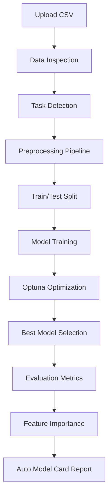

# 🚀 AutoML Benchmarking Tool

### *From Raw CSV → Optimized Model → Auto-Generated Insights in Minutes*

---

## 📌 Project Overview

The **AutoML Benchmarking Bot** is an end-to-end machine learning automation pipeline built in Python and designed to run seamlessly in Google Colab.

It eliminates repetitive ML tasks—data preprocessing, model selection, hyperparameter tuning, and reporting—by combining intelligent automation with powerful libraries like Optuna, Scikit-Learn, and XGBoost.

👉 **Colab Notebook:**
[https://colab.research.google.com/drive/1NbTqpY_7UrasrFZdttIXCiD8aSHYbnJG](https://colab.research.google.com/drive/1NbTqpY_7UrasrFZdttIXCiD8aSHYbnJG)

---

## 🎯 Key Objective

> Build a **self-adaptive ML pipeline** that:

* Accepts raw CSV data
* Automatically determines task type (Classification / Regression)
* Performs preprocessing & feature engineering
* Tunes multiple models using Bayesian optimization
* Generates a **Model Card-style report**

---

# 🧠 System Architecture & Workflow

### 🔄 End-to-End Pipeline Flow

---

## ⚙️ Core Components Breakdown

### 1️⃣ Smart Data Ingestion

* Uses `google.colab.files` for seamless uploads
* Automatically inspects dataset structure
* Detects target variable type:

  * **Categorical / Low Cardinality (<20)** → Classification
  * **Continuous / Numeric** → Regression

💡 *No manual configuration required*

---

### 2️⃣ Automated Preprocessing Pipeline

**Handled automatically:**

* 🧹 **Missing Values** → Median Imputation (robust to outliers)
* 🔤 **Categorical Encoding** → One-Hot Encoding (`pd.get_dummies`)
* 📊 **Data Split** → 80/20 Train-Test split

---

### 3️⃣ Optimization Engine (Optuna)

* Uses **Bayesian Optimization (TPE Sampler)** instead of brute-force grid search
* Intelligent trial pruning speeds up convergence

#### 🔍 Tuned Models:

| Model         | Parameters Tuned                             |
| ------------- | -------------------------------------------- |
| Random Forest | `n_estimators`, `max_depth`                  |
| XGBoost       | `learning_rate`, `max_depth`, `n_estimators` |

* 🔁 **3-Fold Cross Validation** ensures robust performance
* 🚀 Focuses only on promising parameter regions

---

### 4️⃣ Model Benchmarking

* Compares:

  * ✅ Complex Models (Random Forest, XGBoost)
  * ⚖️ Baseline Models (Linear / Logistic Regression)

💡 Helps answer:

> “Is complexity actually improving performance?”

---

### 5️⃣ Automated Documentation (Model Card)

Generates:

* 📊 Performance Metrics (Accuracy, RMSE, etc.)
* 📉 Feature Importance Graph
* 🧾 Markdown Model Report (via `IPython.display.Markdown`)

👉 Ready to copy directly into GitHub / reports

---

## ⚡ Why It’s 18x Faster

| Traditional ML Workflow | AutoML Bot            |
| ----------------------- | --------------------- |
| Manual preprocessing    | Fully automated       |
| Grid Search             | Bayesian Optimization |
| Trial & error tuning    | Smart pruning         |
| Manual reporting        | Instant model card    |

⏱️ **Time Reduced:**
**~3 hours → ~10 minutes**

---

## 🧰 Tech Stack

| Category        | Tools                 |
| --------------- | --------------------- |
| Optimization    | Optuna                |
| ML Models       | Scikit-Learn, XGBoost |
| Data Processing | Pandas, NumPy         |
| Visualization   | Matplotlib, Seaborn   |
| Environment     | Google Colab          |

---

## 🧪 Example Use Cases

* 📊 Quick dataset benchmarking
* 📈 Academic ML experiments
* 🚀 Startup data prototyping
* 🧑‍💻 Learning AutoML pipelines
* ⚙️ Rapid feature importance analysis

---

## 📦 Features Summary

* ✅ Zero-config ML pipeline
* ✅ Automatic task detection
* ✅ Built-in preprocessing
* ✅ Bayesian hyperparameter tuning
* ✅ Model benchmarking
* ✅ Feature importance visualization
* ✅ Auto-generated documentation

---

## ⚠️ Limitations & Improvements

### Current Limitations

* Limited model variety (RF, XGBoost, Linear)
* No deep learning support
* Basic feature engineering
* No deployment/export pipeline

### Future Enhancements

* 🔌 Add LightGBM / CatBoost
* 🧠 Integrate Deep Learning (TensorFlow / PyTorch)
* 🌐 Deploy via FastAPI / Streamlit
* 📦 Export trained pipelines (Pickle / ONNX)
* 📊 Add SHAP explainability

---

## 🧠 Design Philosophy

> “Automate the repetitive. Highlight the insights.”

The project is built around:

* **Simplicity** → Minimal user input
* **Speed** → Smart optimization
* **Transparency** → Interpretable outputs
* **Reusability** → Plug-and-play pipeline

---

## 🏁 Getting Started (Colab)

1. Open the notebook
2. Upload your CSV
3. Select target column
4. Run all cells
5. Get:

   * Best model
   * Metrics
   * Feature importance
   * Model report

---

## 📌 Final Thoughts

The **AutoML Benchmarking Bot** bridges the gap between:

* Manual ML workflows ❌
* Fully automated intelligent pipelines ✅

It’s not just a tool—it’s a **productivity multiplier** for anyone working with data.

---

## ⭐ If You Like This Project

* Star ⭐ the repository
* Fork 🍴 and extend it
* Use it in your ML workflows

---

**Built for speed. Designed for clarity. Powered by intelligence.**
